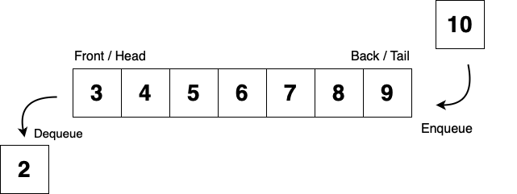

# Queue Data Structure in Golang
Queue Data Structure  is a virtual storage in memory in which the elements are inserted in FIFO (First-In-First-Out). 
The application of queue could be an operating system allocates of tasks. In modern Software architecture, could be 
utilised for API Gateway or Space-Based Architecture Pattern.




## Generics
You will require to use a Go version that has the generic implementation. This allowed me to ensure, this code could
be utilised in various applications where type of elements inside the queue could be programmed.

```go
type QueueElement struct {
    Body string
}

myQueue := queue.NewQueue[*QueueElement]()
myQueue.Enqueue(&QueueElement{
    Body: "{}",
})
```

you could find an example of this inside `example_test.go`.


## Processing & Memory Optimisation
You might have noticed the use of size instead of the use `len`; the built-in library in Go,
this is due to cpu and memory utilisation during the calculation when queue exceeds a high number.


## Encapsulation
In this example you could see `NewQueue`, produces a private `struct` matching `Queuer[T any]` interface.
This is by design to avoid accessing `elements` and `size` of the queue. However, `NewQueue` is not 
utilised inside tests to examine the actual value for `size` and elements in the queue.


__Queue Struct__
```go
type queue[T any] struct {
    items []T
    size  int
}
```

__Queuer Interface__
```go
type Queuer[T any] interface {
    Enqueue(item T)
    Dequeue() (item T, err error)
    Peek() (item T, err error)
    Count() int
    Clear()
}
```

__NewQueue__
```go
func NewQueue[T any]() Queuer[T] {
    return &queue[T]{
        items: *new([]T),
        size:  0,
    }
}
```


### Tests
From the root of the repository, please run the following command:

```bash
go test ./queue/... -v
```


##### Credits
Author: [Hadi Tajallaei](mailto:hadi@syniol.com)

Copyright &copy; 2024, Syniol Limited. All rights reserved.
